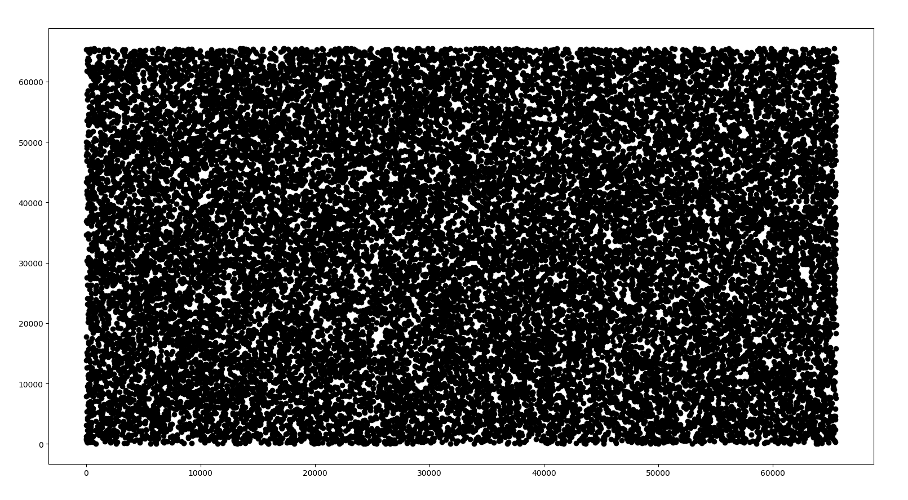
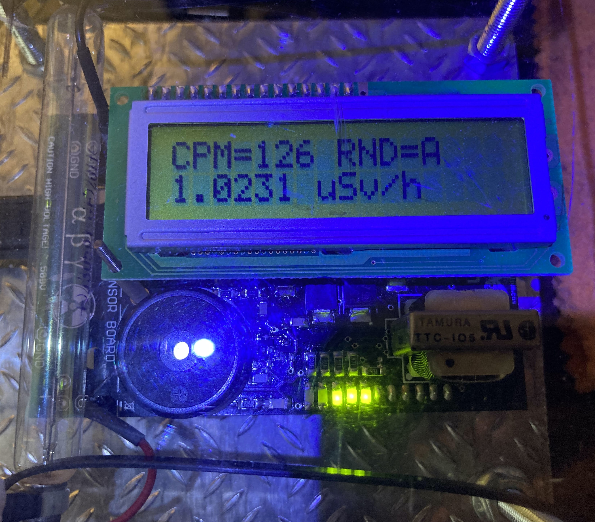

Introduction:
=============

RNG generators based on nuclear decay are a good source of random number. The working principle is relatively simple: they convert the detection of particles in random numbers, using different algorithms. My appliance uses an Arduino board (Diecimila) with a Geiger shield. Both hardware and software components are explained in detail in the following paragraphs.



Hardware:
=========

The days after Fukushima disaster (2011), I and someone I knew bought Geiger counters. I didn't think was even possible that some kind of radioactive cloud was able to reach us here, in Europe, but I had a lot of curiosity about the instrument itself and I found that was a good occasion to learn something interesting.

My first requirement for the instrument I was about to buy was that it had to be a fully documented or, better, an open source project , the second requirement was that it had to be a programmable tool.  I found an Arduino shield ( now discontinued ), produced from company called Cooking-Hacks, able to satisfy both those requirements.

Algoritm:
=========

The RNG algorithm is made very simple relying on interrupts: in the main loop a register is cyclically increased from 0 to n, when it reaches n is reset  to 0. When a particle is detected an interrupt is raised, the main loop is paused and the routine associated to the interrupt is executed, returning the last value of the register as random number then the register is reset to zero and the main loop resumed.
The chosen range is 0-15 represented using hexadecimal digits (0-9A-F), that is convenient because two hex digits represent a full random byte.   

The random numbers are presented on the LCD display at slow rate and through the serial port at faster rate. The display is intended as "virtual dice" usable, for example, with board games, the special device, instead,  to interface the appliance to computer programs.

Installation and Use:
=====================

- compile and deploy the sketch;
- You can read the random numbers on the display or on the serial console;
- This example show how to read produced random numbers from the serial console by command line on OsX systems:
 ```shell
 cat /dev/cu.usbserial-A700700G > rndnums.txt
 ```
* Note: the appliance also write the Geiger radiation values on the serial console, they could be filtered using grep, for example.

Test:
=====

Generated a first sample of 100k random bytes (aka 200k couples of hex digits), I started with basic tests, average value, single values distributions, scatter diagrams. This is the scatter diagram composed using 4 bytes for each point (2 bytes X, 2 bytes Y):



Then, after the basic testing just explained, I tested my sequence with ENT (see here: https://www.fourmilab.ch/random/). ENT is a command line tool providing a way to perform common test on a random sequence to verify the quality of its random numbers.

I installed ENT on my Ubuntu machine:
 ```shell
 apt-get install ent
 ```

In the "test" directory present in this repository, some tools able to convert the ascii streams from my appliance console to binary file and able to perform test with ENT, also a file created reading from /dev/urandom of similar length is provided and testes to compare the two related reports from ENT.

A makefile do all the job:

 ```shell
 make clean all
 ```

I tested the randomness both testing the bytes and the single bits in the binary file created from the ASCII file from the appliance console ( see Appendix here or test directory for full result text).

Accordingly with ENT man page: "If the percentage is greater than 99% or less than 1%, the sequence is almost certainly not random. If the percentage is between 99% and 95% or between 1% and 5%, the sequence is suspect. Percentages between 90% and 95% and 5% and 10% indicate the sequence is “almost suspect”", so having 85.17 percent in the bytes test and 60.52 percent in the bits test should be fine. 

Averages values should be also ok. 

About Monte Carlo Pi Value, as explained in the man page: "he value will approach the correct value of Pi if the sequence is close to random.", then the result, 3.152465586 (error 0.35 percent), should be fine.

In using the conditional here because, to perform more complete tests (i.e. using the dieharder suite - https://webhome.phy.duke.edu/~rgb/General/dieharder.php) a longer random number sequence, 1 to 100 GB of data, should be available but this is beyond my current availability. I hope to perform further tests in the future.

If you found errors or have suggestions about the improvement of this appliance, let me know. Any advice of bug report is welcome.


Appendix:
=========

Test results:
-------------

Bytes:
------

 ```shell
Value Char Occurrences Fraction
  0              393   0.003804
  1              416   0.004027
  2              403   0.003901
  3              407   0.003940
  4              391   0.003785
  5              433   0.004192
  6              370   0.003582
  7              412   0.003988
  8              421   0.004075
  9              408   0.003950
 10              388   0.003756
 11              388   0.003756
 12              425   0.004114
 13              425   0.004114
 14              420   0.004066
 15              400   0.003872
 16              413   0.003998
 17              387   0.003746
 18              385   0.003727
 19              388   0.003756
 20              428   0.004143
 21              403   0.003901
 22              393   0.003804
 23              426   0.004124
 24              399   0.003862
 25              443   0.004288
 26              396   0.003833
 27              374   0.003620
 28              427   0.004133
 29              393   0.003804
 30              404   0.003911
 31              404   0.003911
 32              437   0.004230
 33   !          417   0.004037
 34   "          405   0.003920
 35   #          427   0.004133
 36   $          406   0.003930
 37   %          392   0.003795
 38   &          424   0.004104
 39   '          393   0.003804
 40   (          425   0.004114
 41   )          404   0.003911
 42   *          437   0.004230
 43   +          409   0.003959
 44   ,          397   0.003843
 45   -          386   0.003737
 46   .          398   0.003853
 47   /          412   0.003988
 48   0          420   0.004066
 49   1          395   0.003824
 50   2          432   0.004182
 51   3          427   0.004133
 52   4          399   0.003862
 53   5          420   0.004066
 54   6          430   0.004162
 55   7          413   0.003998
 56   8          388   0.003756
 57   9          423   0.004095
 58   :          388   0.003756
 59   ;          406   0.003930
 60   <          378   0.003659
 61   =          389   0.003766
 62   >          393   0.003804
 63   ?          414   0.004008
 64   @          428   0.004143
 65   A          383   0.003708
 66   B          409   0.003959
 67   C          393   0.003804
 68   D          410   0.003969
 69   E          392   0.003795
 70   F          388   0.003756
 71   G          399   0.003862
 72   H          391   0.003785
 73   I          412   0.003988
 74   J          437   0.004230
 75   K          437   0.004230
 76   L          394   0.003814
 77   M          363   0.003514
 78   N          382   0.003698
 79   O          429   0.004153
 80   P          414   0.004008
 81   Q          376   0.003640
 82   R          408   0.003950
 83   S          394   0.003814
 84   T          396   0.003833
 85   U          401   0.003882
 86   V          407   0.003940
 87   W          411   0.003979
 88   X          450   0.004356
 89   Y          413   0.003998
 90   Z          430   0.004162
 91   [          411   0.003979
 92   \          423   0.004095
 93   ]          391   0.003785
 94   ^          408   0.003950
 95   _          403   0.003901
 96   `          367   0.003553
 97   a          419   0.004056
 98   b          369   0.003572
 99   c          396   0.003833
100   d          410   0.003969
101   e          393   0.003804
102   f          409   0.003959
103   g          417   0.004037
104   h          374   0.003620
105   i          406   0.003930
106   j          402   0.003891
107   k          413   0.003998
108   l          391   0.003785
109   m          401   0.003882
110   n          396   0.003833
111   o          388   0.003756
112   p          426   0.004124
113   q          394   0.003814
114   r          386   0.003737
115   s          427   0.004133
116   t          399   0.003862
117   u          400   0.003872
118   v          416   0.004027
119   w          417   0.004037
120   x          381   0.003688
121   y          392   0.003795
122   z          392   0.003795
123   {          421   0.004075
124   |          384   0.003717
125   }          403   0.003901
126   ~          428   0.004143
127              384   0.003717
128              391   0.003785
129              397   0.003843
130              385   0.003727
131              418   0.004046
132              366   0.003543
133              402   0.003891
134              374   0.003620
135              422   0.004085
136              390   0.003775
137              381   0.003688
138              398   0.003853
139              411   0.003979
140              413   0.003998
141              392   0.003795
142              390   0.003775
143              421   0.004075
144              402   0.003891
145              419   0.004056
146              378   0.003659
147              412   0.003988
148              423   0.004095
149              423   0.004095
150              434   0.004201
151              375   0.003630
152              456   0.004414
153              357   0.003456
154              389   0.003766
155              386   0.003737
156              440   0.004259
157              409   0.003959
158              367   0.003553
159              409   0.003959
160              396   0.003833
161   ?          403   0.003901
162   ?          397   0.003843
163   ?          414   0.004008
164   ?          398   0.003853
165   ?          425   0.004114
166   ?          446   0.004317
167   ?          399   0.003862
168   ?          404   0.003911
169   ?          385   0.003727
170   ?          428   0.004143
171   ?          411   0.003979
172   ?          419   0.004056
173   ?          399   0.003862
174   ?          371   0.003591
175   ?          403   0.003901
176   ?          441   0.004269
177   ?          368   0.003562
178   ?          382   0.003698
179   ?          370   0.003582
180   ?          396   0.003833
181   ?          412   0.003988
182   ?          364   0.003524
183   ?          391   0.003785
184   ?          403   0.003901
185   ?          406   0.003930
186   ?          420   0.004066
187   ?          382   0.003698
188   ?          367   0.003553
189   ?          401   0.003882
190   ?          402   0.003891
191   ?          407   0.003940
192   ?          419   0.004056
193   ?          417   0.004037
194   ?          382   0.003698
195   ?          445   0.004308
196   ?          365   0.003533
197   ?          381   0.003688
198   ?          404   0.003911
199   ?          425   0.004114
200   ?          385   0.003727
201   ?          427   0.004133
202   ?          378   0.003659
203   ?          406   0.003930
204   ?          385   0.003727
205   ?          409   0.003959
206   ?          398   0.003853
207   ?          404   0.003911
208   ?          385   0.003727
209   ?          401   0.003882
210   ?          412   0.003988
211   ?          439   0.004250
212   ?          445   0.004308
213   ?          418   0.004046
214   ?          393   0.003804
215   ?          392   0.003795
216   ?          391   0.003785
217   ?          407   0.003940
218   ?          405   0.003920
219   ?          444   0.004298
220   ?          417   0.004037
221   ?          375   0.003630
222   ?          409   0.003959
223   ?          378   0.003659
224   ?          387   0.003746
225   ?          373   0.003611
226   ?          393   0.003804
227   ?          407   0.003940
228   ?          396   0.003833
229   ?          390   0.003775
230   ?          401   0.003882
231   ?          389   0.003766
232   ?          409   0.003959
233   ?          375   0.003630
234   ?          384   0.003717
235   ?          409   0.003959
236   ?          389   0.003766
237   ?          411   0.003979
238   ?          396   0.003833
239   ?          387   0.003746
240   ?          455   0.004404
241   ?          417   0.004037
242   ?          402   0.003891
243   ?          416   0.004027
244   ?          423   0.004095
245   ?          382   0.003698
246   ?          423   0.004095
247   ?          410   0.003969
248   ?          420   0.004066
249   ?          389   0.003766
250   ?          393   0.003804
251   ?          429   0.004153
252   ?          426   0.004124
253   ?          417   0.004037
254   ?          398   0.003853
255   ?          396   0.003833

Total:        103304   1.000000

Entropy = 7.998386 bits per byte.

Optimum compression would reduce the size
of this 103304 byte file by 0 percent.

Chi square distribution for 103304 samples is 231.52, and randomly
would exceed this value 85.17 percent of the times.

Arithmetic mean value of data bytes is 127.2572 (127.5 = random).
Monte Carlo value for Pi is 3.152465586 (error 0.35 percent).
Serial correlation coefficient is -0.005576 (totally uncorrelated = 0.0).
 ```
Bits:
-----

 ```shell
Value Char Occurrences Fraction
  0           413451   0.500284
  1           412981   0.499716

Total:        826432   1.000000

Entropy = 1.000000 bits per bit.

Optimum compression would reduce the size
of this 826432 bit file by 0 percent.

Chi square distribution for 826432 samples is 0.27, and randomly
would exceed this value 60.52 percent of the times.

Arithmetic mean value of data bits is 0.4997 (0.5 = random).
Monte Carlo value for Pi is 3.152465586 (error 0.35 percent).
Serial correlation coefficient is 0.000822 (totally uncorrelated = 0.0).
 ```

